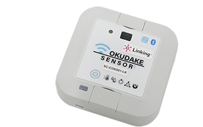

# おくだけセンサー リンク デモアプリ
---

このリポジトリは、おくだけセンサー リンクのAndroid向けアプリのapkファイルとソースコードを含みます。  
対象バージョンは、API 26: Android 8.0 (Oreo)以上です。  
このアプリは、おくだけセンサー リンクのデモンストレーションを目的としており、ビーコン情報の受信とGATT通信、IFTTT連携の機能を持ちます。  
[link_demo_app/ ../okudakelinkdemoapp/okudake](link_demo_app/app/src/main/java/com/sun/m2m/okudakelinkdemoapp/okudake)
をプロジェクトにインポートすることでビーコンの受信とGATT通信の実装を省略できます。

## おくだけセンサー リンク
---
  
おくだけセンサーリンクはBLEビーコン、GATT通信、Linking※に対応したマルチセンサーデバイスです。  
詳細については、公式Webサイトをご確認ください：https://www.sun-denshi.co.jp/sc/lglk/#sumlk

※:「Linking」および「Linking」ロゴは株式会社NTTドコモの商標です。

## ライセンス (License)
---
このコードおよびバイナリは、[BSD 3-Clause](LICENSE)に基づいて配布されます。
